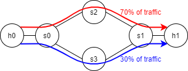

Weighted Tunnels for Mininet / Open vSwitch
===========================================

Weighted Tunnels enables individual flows to be split multiple tunnels in a network. In real networks, traffic is split at a coarse granularity-- e.g. assigning 100 users to tunnels 1 and 50 users to tunnel 2. This poses a challenge for Mininet users, who don't have datacenters, world-wide networks, or hundreds of flows to simulate.

By dividing individual flows over multiple tunnels, Weighted Tunnels allows researchers to simulate this splitting with single flows and far fewer sessions. In other words, it lets Mininet be Mini again!

The Weighted Tunnels daemon runs on Mininet hosts. It intercepts and mangles packets to send them on different tunenls. For easy integration with Mininet, a helpful Python script is included that manages the Daemon and sets up tunnels in a Mininet environment.

The Python script for Weighted Tunnels works with Python 3.8 [#python]_, Mininet 2.3.0 [#mininet]_, Open vSwitch OpenFlow 15 [#ovs]_, and iperf3 [#iperf3]_. Under the hood, Weighted Tunnels uses the libnetfilter_queue 1.0.3 [#nfq]_ library for intercepting packets. 

How Weighted Tunnels Works
==========================

First, the Python script launches and configure the Weighted Tunnels Daemon on a Mininet host. The Daemon will then intercept UDP packets entering and leaving its mininet host. It selects tunnels by modifying the source port on each of these packets.

Generally, each transport-level flow is characterized by a unique source-destination port pair, such as Host A port 1234 <-> Host B port 22. Instead of using a unique source port, Weighted Tunnels uses a range of source ports for each flow. For example, a UDP connection takes place on port 500. The Weighted Tunnels Daemon assigns this flows ports 500-515.

Every time a packet comes out of port 500 on the sender, the sender's daemon will intercept the packet and change the source port to somewhere 500-515. The packet traverses the network, then arrives at the receiver, where the receiver's daemon changes the source port back to 500.

The magic of Weighted Tunnels is this: Both the sender and receiver see the same port, 500. The network sees 16 unique flows, source port 500-515, depending on the daemon's port choice. Using this, we can set up flow rules to send this flow's packets on up to 16 unique tunnels through the network.

Why Weighted Tunnels
====================

Weighted Tunnels is *fast*. Of options we tested, Weighted Tunnels was the fastest by far and the only one able to compete with bare-bones Mininet in terms of maximum throughput through the network. 

Options we tried:

* **Stochastic OVS**: The Open vSwitch was modified to support random tunnel outputs. Unfortunately, this was very slow and had a high loss rate for large networks, as per-packet randomization means that switches can't use caches for flow rules. Code is here: https://github.com/tanner-andrulis/stochastic-ovs
* **Completely Random Ports**: Similar to Weighted Tunnels, but using completely random ports. Then, Open vSwitch forwarding groups were set up, and the random ports were used to simulate many flows going through the switches. Unfortunately, the large number of unique ports could not be stored in the switch caches, leading to slow, high-loss networks.
* **Scapy Port Interception**: Again similar to Weighted Tunnels, but using Python and the Scapy library for packet interception. This was found to be far too slow due to the overheads of using Python.
* **Weighted Tunnels**: Fixes all of the above problems. Each flow/tunnel combination has exactly one set of ports, so flow rules fit in the switch caches. An extremly fast C-based daemon forwards packets at a high rate.

Using Weighted Tunnels
======================

Setting up and running Weighted Tunnels is easy from Python script. For example, in the below code from example.py we send one flow on two tunnels in porportions 70/30. An image of the topology and desired flows are shown below.

.. code-block:: python

    # Build topology
    topo = Example()
    net = Mininet(topo)
    net.start()

    # Add flow rules to connect hosts
    weighted_tunnels.add_flow_to_host(net, 0)
    weighted_tunnels.add_flow_to_host(net, 1)

    # h0 -> h1 has two tunnels:
    # Tunnel 0: s0 -> s2 -> s1
    weighted_tunnels.add_flow_tunnel(net, switch_num=0, out_switch=2, from_host=0, to_host=1, tunnel_num=0)
    weighted_tunnels.add_flow_tunnel(net, switch_num=2, out_switch=1, from_host=0, to_host=1, tunnel_num=0)
    # Tunnel 1: s0 -> s3 -> s1
    weighted_tunnels.add_flow_tunnel(net, switch_num=0, out_switch=3, from_host=0, to_host=1, tunnel_num=1)
    weighted_tunnels.add_flow_tunnel(net, switch_num=3, out_switch=1, from_host=0, to_host=1, tunnel_num=1)

    # h1 -> h0 has one tunnel, so we can just do flows:
    # All packets travel s1 -> s2 -> s0
    weighted_tunnels.add_flow(net, switch_num=2, out_switch=0, from_host=1, to_host=0)
    weighted_tunnels.add_flow(net, switch_num=3, out_switch=0, from_host=1, to_host=0)
    weighted_tunnels.add_flow(net, switch_num=1, out_switch=2, from_host=1, to_host=0)

    # Weight tunnels
    weighted_tunnels.start_daemon(net, 0)
    weighted_tunnels.start_daemon(net, 1)
    weighted_tunnels.set_tunnel_weights(host_num=0, weights=[[.3, .7]])

More advanced usage can be found in tester.py. Additionally, the Weighted Tunnels Daemon can be used directly from the command line on each host; feel free to adapt the commands put together in weighted_tunnels.py for your own purposes.

Weighted Tunnels Source Port Numbering
======================================

Weighted Tunnels uses specific ports to ensure tunnels can be set up quickly and reliably. The port numbering system is described below. Note that in iperf3 sessions, the client sends data to the server, so the client is the sender and the server is the receiver.

Port numbering depends on four values:
  max_tunnels_per_flow: Fixed at compile time in weighted_tunnels.c, this value is set to 16.

  max_flows: Also fixed at compile time, this value is set to 128. Each host can send up to 128 flows and receive an additional 128 flows. This essentially allows us to have 128 hosts each supporting a bideractional data transfer, or up to 2 * 128 * 128 iperf3 sessions system-wide. 

  receive_start_port: The first port used for iperf3 servers. A block of size max_flows will be used for iperf3 servers starting at this port. For example, using the default value of 10000, we will have ports 10000 to 10127 used for iperf server sessions on each host.

  send_start_port: The first port used for iperf3 clients (senders). A block of size max_flows*max_tunnels_per_flow will be used for iperf3 clients starting at this port. For example, using the default value of 20000, we will have ports 20000 to 20000 + 16 * 128 - 1 used for iperf client sessions on each host.

Receiver ports are assigned depending on the sender number. Assuming receive_start_port=10000, Weighted Tunnels expects the flow from host 0 to have destination port 10000, the flow from host 1 to have destination port 10001, and so on.

Sender ports are assigned in blocks depending on the receiver number. Assuming send_start_port=20000 and max_tunnels_per_flow=16, the flow to host 0 will have source ports 20000-20015, the flow to host 1 will have source ports 20016-20031, and so on.

Let's say we would like a flow from host 2 to host 3. We calculate the sender port as
  destination # * max_tunnels_per_flow + send_start_port = 3 * 16 + 20000 = Port 20048 on host 2

We calculate the destination port as
  source # + receive_start_port = 2 + 10000 = Port 10002 on host 3

We can now launch an iperf3 client from host 2 port 20048 and server host 3 port 10002. After leaving the client (sender) and passing through the daemon, packets on the network will have source port 20048 + tunnel_number depending on selected tunnel. Packets travelling back from the server to the client will all have source port 10002 destination port 20048.

All numbering is handled automatically by the Python script. The get_iperf_ports function is available to calculate necessary ports for any sender/receiver combination.

Performance
===========

Weighted Tunnels is able to provide multi-tunnel routing with little overhead. For large networks, there is a very small increase in CPU usage on test systems. The network and flows themselves, however, contribute the vast majority of all CPU usage, and Weighted Tunnels incurs a negligible overhead.

Note that **latency was NOT tested for performance metrics.** If a single flow is split up among multiple tunnels, latency is going to be hugely variable anyway due to varying tunnel speeds.

Code
====

Files:
  example.py: Example script for tunnel weighting.

  weight_ports.c: The source code for the Weighted Tunnels Daemon

  weight_ports.py: Helpful Python functions for managing daemons and setting up flows

  tester.py: A more advanced test script that tests realtime weight changes and compares maximum bandwidth to stock Mininet.

  Makefile: Makefile for building Weighted Tunnels
  

Installing Weighted Tunnels
===========================

Code can be built with the following commands. 

.. code-block:: bash

  git clone https://github.com/tanner-andrulis/Weighted-Tunnels
  cd Weighted-Tunnels
  sudo -s
  make install_dependencies
  make build

Running
-------

.. code-block:: bash

  sudo -s
  make run_example
  make run_tester

Useful References
=================

All sites accessed 7/29/2021
  
  .. [#ovs] Website at https://www.openvswitch.org/ and Github at https://github.com/openvswitch/ovs
    
  .. [#mininet] http://mininet.org/
  
  .. [#python] https://www.python.org/downloads/
  
  .. [#iperf3] https://iperf.fr/iperf-download.php

  .. [#nfq] https://www.netfilter.org/projects/libnetfilter_queue/

Contact
=======

This work was completed in the Purdue Internet Systems Lab by Tanner Andrulis in collaboration with Chuan Jiang and Sanjay Rao.

Questions, comments, concerns? Email Tanner Andrulis at andruils@mit.edu

License
=======

Weighted Tunnels is licensed under the open source MIT License

Copyright (c) 2021 Tanner Andrulis, Chuan Jiang, Sanjay Rao, Purdue Internet Systems Lab

Permission is hereby granted, free of charge, to any person obtaining a copy
of this software and associated documentation files (the "Software"), to deal
in the Software without restriction, including without limitation the rights
to use, copy, modify, merge, publish, distribute, sublicense, and/or sell
copies of the Software, and to permit persons to whom the Software is
furnished to do so, subject to the following conditions:

The above copyright notice and this permission notice shall be included in all
copies or substantial portions of the Software.

THE SOFTWARE IS PROVIDED "AS IS", WITHOUT WARRANTY OF ANY KIND, EXPRESS OR
IMPLIED, INCLUDING BUT NOT LIMITED TO THE WARRANTIES OF MERCHANTABILITY,
FITNESS FOR A PARTICULAR PURPOSE AND NONINFRINGEMENT. IN NO EVENT SHALL THE
AUTHORS OR COPYRIGHT HOLDERS BE LIABLE FOR ANY CLAIM, DAMAGES OR OTHER
LIABILITY, WHETHER IN AN ACTION OF CONTRACT, TORT OR OTHERWISE, ARISING FROM,
OUT OF OR IN CONNECTION WITH THE SOFTWARE OR THE USE OR OTHER DEALINGS IN THE
SOFTWARE.
